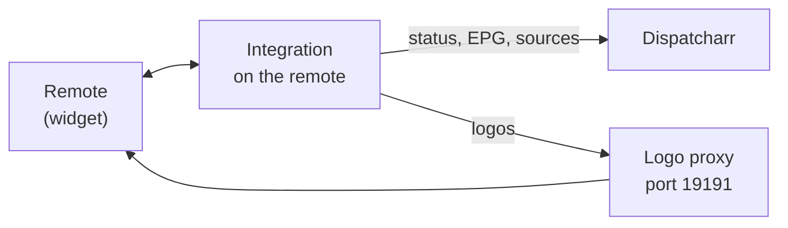

# Dispatcharr for Unfolded Circle Remote

Show what's playing on your IPTV box — right on your Unfolded Circle Remote.

This custom integration connects your remote to
[Dispatcharr](https://github.com/Dispatcharr/Dispatcharr) and displays the
channel logo, the current program and its progress for one playback device.
When a stream stutters, switch to another source with a single tap.

<!-- Screenshot: add a photo of the widget as docs/screenshot.png and uncomment:

-->

- [Features](#features)
- [Requirements](#requirements)
- [Installation](#installation)
- [Setup](#setup)
- [Entities](#entities)
- [How it works](#how-it-works)
- [Troubleshooting](#troubleshooting)
- [Development](#development)
- [License](#license)

## Features

- 📺 **Now playing widget** — channel logo, EPG title and progress bar for the
  device you choose (e.g. NVIDIA Shield or Apple TV)
- 🔀 **Source switching** — next / previous source, pick one from the list,
  or simply tap the logo
- 🔘 **"Next Source" button** — for UI pages and macros, works without the
  widget
- 🖼️ **Clean logos** — logos are trimmed and scaled so they look consistent
- 🔋 **Battery friendly** — only polls while the widget is in use, pauses in
  standby
- 🏠 **Runs on the remote** — no extra server or Docker container needed

The integration does not control playback. Use your player's integration
(e.g. Android TV or ADB Bridge) in the same activity for that.

## Requirements

| | |
|---|---|
| **Remote** | Remote 3 (Remote Two should work too, but is untested) — firmware 2.9.3+ recommended for in-place updates |
| **Dispatcharr** | Reachable from the remote, with an API key |
| **API user** | Admin rights — needed for switching sources |

## Installation

1. Download `uc-intg-dispatcharr-<version>-aarch64.tar.gz` from the
   [latest release](https://github.com/FoxTraill/uc-intg-dispatcharr/releases/latest).
2. Open the web configurator → **Integrations** → **Add new** →
   **Install custom** and upload the file. Don't extract it.
   To update, upload the new file and check **Update existing driver**.
3. Complete the setup (see below).
4. Add the entities to your TV activity.

## Setup

| Field | Example | Description |
|---|---|---|
| **Dispatcharr URL** | `http://192.168.1.10:9191` | Address of your Dispatcharr server |
| **API key** | | API key of a Dispatcharr user with admin rights |
| **Client IP** | `192.168.1.50` | IP of the device you watch on — only its stream is shown |
| **Poll interval** | `10` | How often the status is refreshed, 5–60 seconds |

## Entities

| Entity | Type | What it does |
|---|---|---|
| `dispatcharr_now_playing` | Media player | Widget with logo, program and progress |
| `dispatcharr_next_source` | Button | Switches to the next source of the running channel |

### Media player attributes

| Attribute | Content |
|---|---|
| State | `Playing` while your client watches a channel, otherwise `Off` |
| Title | Current program (with episode title), or the channel name without EPG data |
| Artist | Active source, e.g. `RTL · 2/7 · Provider` (prefixed with the channel name if there is no logo) |
| Artwork | Channel logo from the built-in logo proxy |
| Position / duration | Progress of the current program |
| Media type | `channel` |
| Source / source list | Sources of the running channel, in failover order |

### Media player commands

| Command | Action |
|---|---|
| Next | Switch to the next source (wraps around) |
| Previous | Switch to the previous source |
| Select source | Switch to the selected source |
| Play / pause | Tapping the logo in the widget — switches to the next source |

Playback commands like play, pause or volume are not supported. Use your
player's integration for those.

## How it works

The integration polls Dispatcharr for active streams and picks the one
watched by your client IP. Channel logos are served by a small built-in proxy
that trims and resizes them for the widget.

## Troubleshooting

<b>Switching sources does nothing</b>

The API key needs admin rights in Dispatcharr (the log shows HTTP 403).
Switching also only works while the channel is actually playing, and the
channel needs more than one source.

<b>The widget stays empty</b>

Check that **Client IP** matches the IP address Dispatcharr shows for your
player under *Stats*. If your player uses a VPN or proxy, Dispatcharr sees
that address instead.

<b>A logo looks wrong</b>

Logos come from Dispatcharr. Very small or low-resolution source images stay
small or blurry. Please open an issue with the channel name.

<b>Where are the logs?</b>

Web configurator → **Settings** → **Development** → **Logs**. Please attach
the relevant part when opening an issue.

## Development

Building, releasing and technical details are described in
[docs/development.md](docs/development.md).

## Versioning

This project uses [Semantic Versioning](https://semver.org/). Available
versions are listed on the
[releases page](https://github.com/FoxTraill/uc-intg-dispatcharr/releases).

## Changelog

All notable changes are documented in the [changelog](CHANGELOG.md).

## Contributions

Bug reports and ideas are welcome — please
[open an issue](https://github.com/FoxTraill/uc-intg-dispatcharr/issues/new/choose).
For general questions about the remote, the
[Unfolded Circle community forum](https://unfolded.community/) is the best
place.

## License

This project is licensed under the [MIT License](LICENSE). It is provided
"as is", without warranty of any kind. Bundled third-party packages keep
their own licenses, see [docs/licenses.md](docs/licenses.md).

## Credits

- [Dispatcharr](https://github.com/Dispatcharr/Dispatcharr) — IPTV stream
  and EPG management
- [Unfolded Circle integration library](https://github.com/unfoldedcircle/integration-python-library)
  — Python API wrapper for the remote
